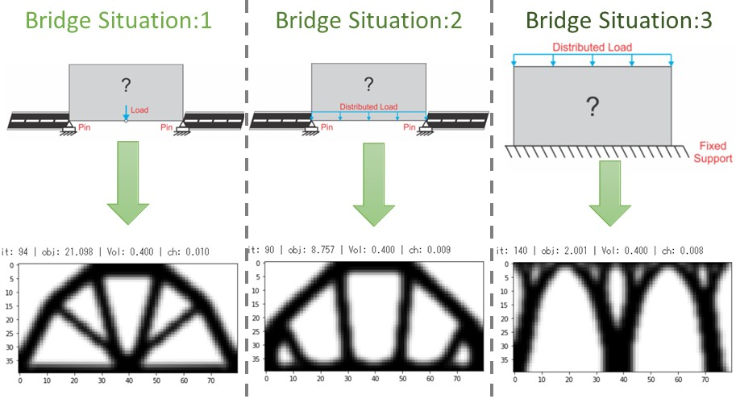
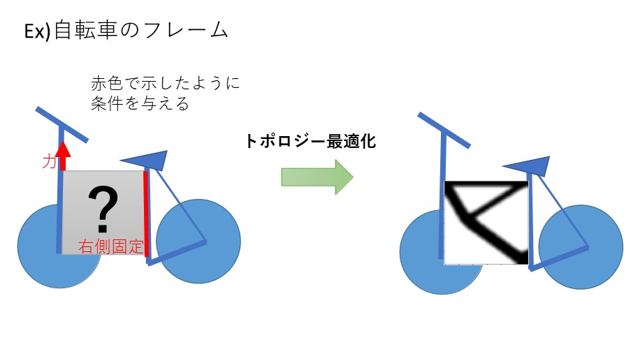

# Topology-Opt-Bridge

## 作品
トポロジー最適化を用いた橋の2Dモデルプログラム．

## 概要
このプログラムは，トポロジー最適化を用いて橋の2Dモデル作成の様子を見る．
トポロジー最適化は，DTU.dkのtopopt.pyを参考にしている．

URL：DTU.dk."Topology optimization codes written in Python"

https://www.topopt.mek.dtu.dk/Apps-and-software/Topology-optimization-codes-written-in-Python

## トポロジー最適化
トポロジー最適化の目的は，歪みエネルギーを最小限に抑えて，制約(構造として必要不可欠なもの）を満たすことです．
 
 問題の定式化は以下のようになる．
 

 
 トポロジー最適化で使用する材料モデルはSIMP(Solid Isotropic Material with Penalization)法．
 これは，材料を正方形の集合体で表し，各正方形には材料が必要(黒=1)～除去(白=0)の範囲の密度を持つ．
 最適化の際の中間密度(グレー)を最終的な設計で回避するために"ペナルティ"が課せられる．
 
## プログラムの構成                

1. 問題のモデル化．設計の初期化．
2. 目的関数の計算
3. 目的関数の感度分析
4. 設計変数の更新
5. 2~4の操作を収束するまで繰り返す．

## 環境
- ファイル構造(src/)
  - bridge_1.py
    - situation1のトポロジー最適化
  - bridge_2.py
    - situation2のトポロジー最適化
  - bridge_3.py
    - situation3のトポロジー最適化
    

 - その他(src/)
    - bicycle.py
      - 条件の与え方次第で，橋以外にも適応できる

- 実行環境
  - Python 3.8
  - numpy
  - scipy
  - matplotlib

- コードの実行
  - 実行環境を作成． 
  - python bridge_1.pyで実行
  
## main変数の説明
- メッシュの細かい粗い(nelx,nelyの値)はトポロジー設計に影響しない．細かいほどなめらかな結果が得られる．
- 体積分率(volfrac)は指定した長方形の領域に含まれる材料必要(黒色)の割合．
- ペナルティ(penal)は材料必要(黒)・不必要(0)に関わってくる．ペナルティがない(penal = 0.0 ~ 1.0)場合，中間密度が発生し，最終結果にグレーが含まれる．  
     - 推奨値:penal=2.0~3.0
- フィルター解析(rmin)は目的関数値に影響しない．rminを低くすると，よりスムーズなトポロジー解が得られる．

