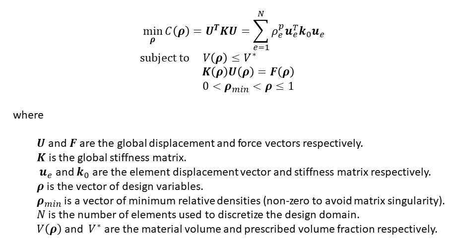

# Topology-Opt-Bridge

## 作品名
トポロジー最適化を用いた橋の2Dモデルプログラム．

## 概要
このプログラムは，トポロジー最適化を用いて橋の2Dモデル作成の様子を見る．
トポロジー最適化は，DTU.dkのtopopt.pyを参考にしている．

URL：DTU.dk."Topology optimization codes written in Python"

https://www.topopt.mek.dtu.dk/Apps-and-software/Topology-optimization-codes-written-in-Python

## トポロジー最適化
トポロジー最適化の目的は，歪みエネルギーを最小限に抑えて，制約(構造として必要不可欠なもの）を満たすことです．
 問題の定式化は以下のようになります．
 

 トポロジー最適化で使用する材料モデルはSIMP(Solid Isotropic Material with Penalization)法です．
 これは，材料を正方形の集合体で表し，各正方形には材料が必要(黒=1)～除去(白=0)の範囲の密度を持ちます．
 最適化の際の中間密度(グレー)を最終的な設計で回避するために"ペナルティ"が課せられます．
 
## プログラムの構成                

1. 問題のモデル化．設計の初期化．
2. 目的関数の計算
3. 目的関数の感度分析
4. 設計変数の更新
5. 2~4の操作を収束するまで繰り返す．

## 環境
- ファイル構造
  - bridge_sample.py
    - プログラムが動くか確認．
  
- 実行環境
  - Python 3.8
  - numpy
  - scipy
  - matplotlib
  
## 注意事項
- 変数が何を表しているか理解．

